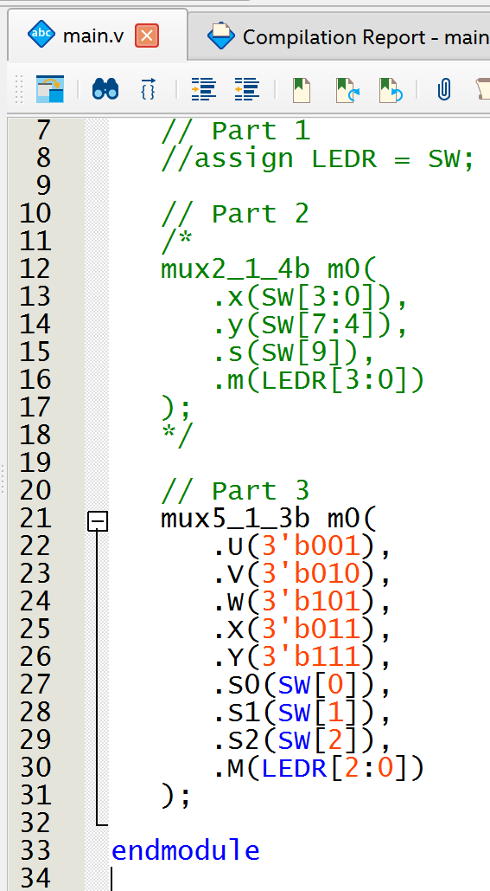

## Table of Contents
<!-- TOC start (generated with https://github.com/derlin/bitdowntoc) -->

- [Lab 1 Report](#lab-1-report)
   * [Part I](#part-i)
   * [Part II](#part-ii)

<!-- TOC end -->

# Lab 1 Report

For this report we are using the DE10-Lite board from Altera.

## Part I

This answer was modified in order to meet the I/Os that the DE10-Lite board has - 10 LEDs and 10 switches.

## Part II

I needed to modified the assignment in order to have a 2-to-1 multiplixer of 4bits instead of 8bits

## Part III

For this part, instead of using the switches to the input of the multiplexer, I provided fixed values.

> ⚠️ **Warning:** There is a major flaw in this implementation. The selects on the multiplexer have 8 possible combinations and the multiplexer only has 5 inputs. What happens when I select greater than 5?
